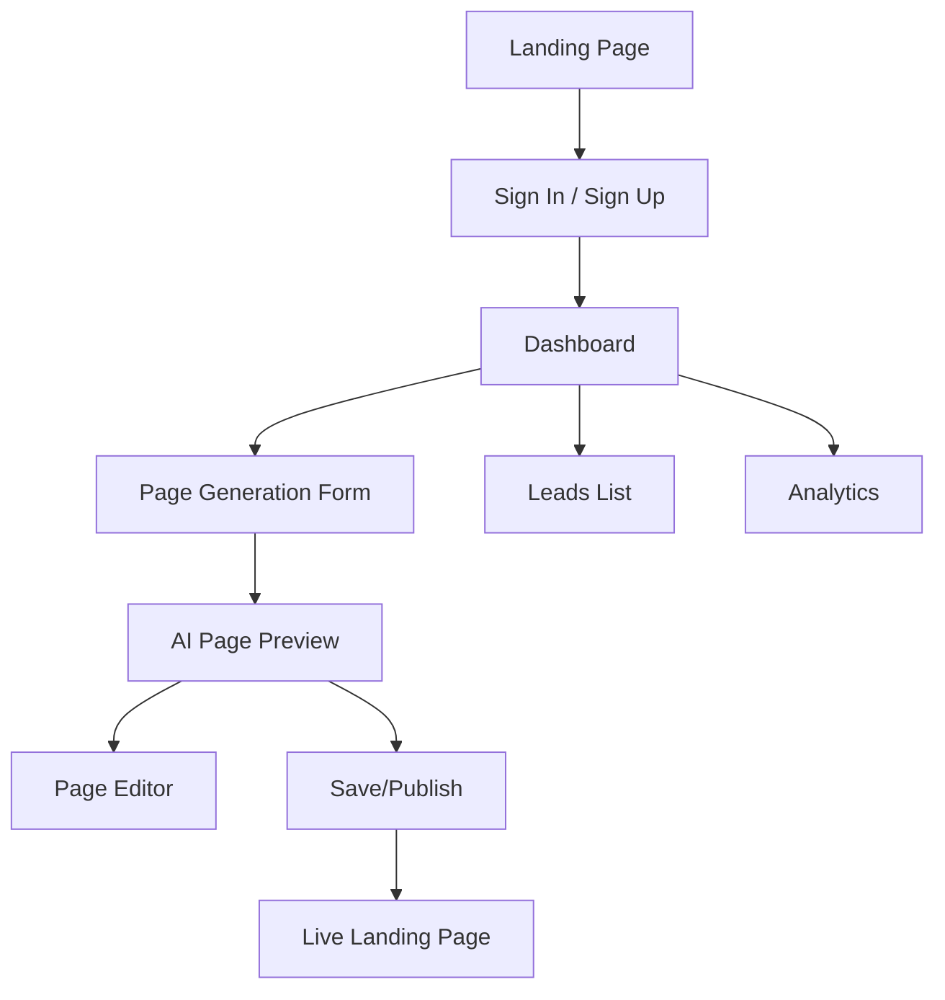

# 🎨 LaunchGen Frontend Roadmap

This document outlines the high-level plan for building the LaunchGen frontend, based on the system specification and overall roadmap. It includes required screens, flows, and a wireframe overview for the MVP.

---

## 🏗️ Major Screens & Flows

### 1. Landing Page
- Hero section
- Features section
- How it works
- Testimonials
- Final CTA
- Navigation (Sign In/Sign Up)
- Footer

### 2. Authentication
- Sign In page
- Sign Up page
- Auth error/success states

### 3. Page Generation Flow
- Prompt input form ("Describe your product idea")
- Generation progress indicator
- AI-generated landing page preview
- Option to save/generate again

### 4. User Dashboard
- List of user landing pages
- Create new page button
- View/edit page config
- Leads overview per page
- Analytics summary per page
- Navigation/sidebar

### 5. Page Editor
- Inline editing of text
- Theme color picker
- Image upload/replace
- Real-time preview
- Save/publish controls

### 6. Lead Management
- List of leads per page
- Export as CSV
- Lead details modal

### 7. Analytics
- Page views/events chart
- Conversion rate display
- Filter by date/page
- Published status indicator
- Page status badge (Published/Draft)

### 8. Dynamic Landing Page Renderer
- Rendered from AI config
- Lead capture form
- Analytics script injection
- Responsive design

---

## 🗺️ Wireframe Overview

---

## ✅ Frontend Checklist

- [x] Landing page UI
- [x] Sign In/Sign Up UI
- [x] Page generation form & flow
- [x] AI landing page preview
- [x] Make landing page editable, saveable, and publishable
- [x] Supabase integration for saving/publishing
- [x] Dashboard layout & navigation
- [x] Page list & create new page
- [x] Page editor (inline, theme, image)
- [x] Dynamic landing page renderer
- [x] Leads list & export (list complete, export next)
- [x] Analytics UI (views, submits, conversion rate, published status)
- [x] Conversion tracking (form submits)
- [x] Delete landing page with confirmation modal
- [x] Sticky sidebar navigation with user's generated pages list
- [x] Collapsible sidebar with toggle button for better space utilization
- [x] Full-width landing page editor with collapsible side panel
- [x] Mobile/desktop preview toggle for responsive design testing
- [x] Enhanced page generation flow with loading states and auto-navigation
- [x] Optimized dashboard navigation bar height for better space utilization
- [x] Auto-resizing textareas in landing page editor for improved UX
- [x] Sticky preview header in landing page editor for persistent controls
- [x] Always-expanded sidebar for consistent navigation experience
- [x] Clean UI with removed duplicate elements and improved visual hierarchy
- [x] Business name and logo customization in landing page templates
- [x] AI-generated business names when not specified by user
- [x] Default logo placeholder for pages without custom logos
- [x] Business editing section in page editor with name and logo inputs
- [x] Sophisticated light/dark theme system with single accent color
- [x] Theme mode selector (light/dark) in page editor
- [x] Accent color picker for buttons, icons, and highlights
- [x] Dynamic opacity variations for accent color usage
- [x] Theme-aware styling across all landing page components
- [x] Dashboard sidebar overlay behavior on edit pages for full-width editing experience
- [x] Dashboard top bar consolidation with editable page title and modern action buttons for improved space efficiency
- [x] Field-level auto-save system for intelligent background saving when users exit input fields
- [x] Enhanced theme mode selection with modern shadcn dropdown featuring sun/moon icons and visual indicators
- [x] Updated black theme background color to pure black (#000000) for maximum contrast and modern appearance
- [x] Fixed IconSelector icon library integration with correct Lucide React icon names
- [x] Fixed IconSelector duplicate key errors and created unified icon selection system
- [x] Updated AI prompt templates to use comprehensive icon names from iconUtils.ts for better icon variety in generated pages
- [x] Enhanced AI theme selection with business analysis and comprehensive color guidelines for 15+ business categories

---

## 🔄 How to Use This Roadmap
- Use this as a reference for required screens and flows
- Check off items as they are completed
- Update wireframes and checklist as the UI evolves

---

## Dashboard Authentication & Session Management
- Refactored dashboard to use client-side session/auth logic only.
- Removed server-side session check and redirect.
- All dashboard data fetching now happens on the client after session is confirmed.
- Fixes redirect loop after login and OAuth. 

## Recent UI/UX Improvements
- **Dashboard Sidebar**: Sticky positioning with user's generated pages list for quick navigation
- **Landing Page Editor**: Full-width preview with collapsible side panel and mobile/desktop toggle
- **Page Generation**: Enhanced flow with loading animation, auto-save, and navigation to edit page
- **Navigation**: Optimized top bar height and always-expanded sidebar for better space utilization
- **Editor Experience**: Auto-resizing textareas and sticky preview header for improved usability
- **Dashboard Layout**: Smart sidebar that hides on edit pages and becomes an overlay when hovering near the left edge
- **Dashboard Top Bar**: Consolidated action buttons with editable page title, modern monochrome styling, and improved space utilization 